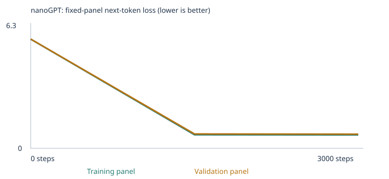
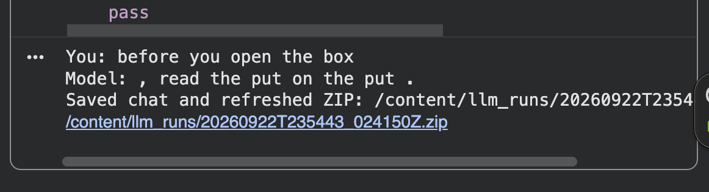

# Class 4: Training and evaluating a tiny language model

Two models were trained from scratch using the supplied nanoGPT: one on the classroom corpus and one on the classroom corpus plus sequence and spatial-relations examples. Both completed **3,000 steps at an initial learning rate of 0.001**. All-case four-choice success rose from **20/48 to 26/48** between the trained models. The expanded model still produced incoherent chat replies, including on a prompt with no unknown words. These results support learning of narrow patterns, not reliable conversation or general reasoning.

## Executed experiments and evidence

- [Classroom executed notebook](classroom_3000_steps.ipynb)
- [Expanded executed notebook](expanded_sequence_spatial_executed.ipynb)
- [Fixed 48-case suite](evals/language_evals.json), [unchanged evaluation runner](run_evals.py), [artifact audit](evidence/artifact_audit.json)
- [Expanded chat transcript](evidence/expanded/chat_transcript.json) and [screenshot](evidence/chat/third_interaction.png)

The updated expanded notebook includes the executed Section 10 cell and its third chat interaction. Its prompt, response and run identifier agree with the separately saved three-turn transcript and screenshot. All earlier training and evaluation cell outputs match the previous download. Both notebooks retain their loss panels and inspections with no saved error outputs.

## Choices, sources, and predictions

The final runs used 3,000 updates, rather than the initially discussed 3,500. This keeps the experiment near the assignment’s starting budget. A step uses a batch of 32 passages; it is not a full pass through the corpus. The initial learning rate 0.001 is the assignment’s suggested starting point, with warmup and cosine decay. Very large updates can destabilize training; very small updates can slow learning. Both runs used seed 42, CPU, two transformer blocks, four attention heads, 64-number embeddings, and a 48-token context. The architecture is unchanged, although the larger vocabulary increases the embedding table and parameter count.

The classroom source is the course’s synthetic sentence generator, with the pinned nanoGPT code and its [MIT license](NANOGPT_LICENSE). The extension files are original AI-assisted practice material prepared during this project: [sequence.txt](corpus/sequence.txt) and [spatial_relations.txt](corpus/spatial_relations.txt). They are included as project teaching material; no private records or third-party documents were imported. The student chose these two categories; the assistant drafted the examples. Sequence examples teach event order and before/after relations; spatial examples teach containment, vertical relations, and left/right. The generator [source](prepare_teaching_examples.py) does not read evals or results. No PDFs were used, and the imported files had no extraction warnings.

The classroom prediction saved in the uploaded notebook says: “I predict that it will fail with unfamiliar vocabulary. I also think that by not using the negtation feature, there may be more errors initially.” The earlier conversation also expected more effective use of familiar text. Negation is a skill rather than a switchable feature, and more steps cannot add words to a fixed vocabulary. The notebook’s wording is preserved, not retroactively corrected.

The expanded pre-training prediction says: “I predict that words missing from the expanded training vocabulary will still cause failures. The added examples may improve sequence and spatial-relation results. Because we are not specifically adding negation teaching examples, I expect negation tests to remain difficult.” The results partly support this: coverage increased, but 19 tests remained out of vocabulary; only one sequence and one spatial case were correct. Negation remained unscorable.

| Setting | Classroom | Expanded |
| --- | --- | --- |
| Unique passages | 4592 | 4953 |
| Added unique passages | 0 | 361 |
| Training / validation passages | 4132 / 460 | 4457 / 496 |
| Vocabulary incl. 3 special tokens | 136 | 294 |
| Training unknown-token rate | 0.00% | 0.00% |
| Held-out unknown-token rate | 0.00% | 0.09% |
| Parameters | 111872 | 121984 |
| Completed steps | 3000 | 3000 |
| Training-loop seconds | 56.917 | 60.971 |
| Interrupted | False | False |

The 93 sequence lines became 186 passages; the 92 spatial lines became 175, for 361 new unique passages. Sentence splitting separates some multi-sentence teaching examples into different passages. That can remove the context needed to learn a relation and is a plausible limitation, not a proven explanation of these results. Added passages are only about 7.3% of the expanded corpus.

Runs used Python 3.13.15 and PyTorch 2.11.0+cpu on Linux x86_64 in Colab. The recorded hardware string does not identify the CPU model. Reported seconds cover the training loop, not setup and all evaluations.

**Classroom provenance:** [config.json](evidence/classroom/config.json), [training_summary.json](evidence/classroom/training_summary.json), [corpus_manifest.json](evidence/classroom/corpus_manifest.json), [vocabulary_report.json](evidence/classroom/vocabulary_report.json), [split.json](evidence/classroom/split.json), [training.csv](evidence/classroom/training.csv).

**Expanded provenance:** [config.json](evidence/expanded/config.json), [training_summary.json](evidence/expanded/training_summary.json), [corpus_manifest.json](evidence/expanded/corpus_manifest.json), [vocabulary_report.json](evidence/expanded/vocabulary_report.json), [split.json](evidence/expanded/split.json), [training.csv](evidence/expanded/training.csv).

## Evaluation results and separation

Each case ranks four single-word candidates by next-token probability. Only the prompt enters the model; the answer key scores afterward. Ties earn zero. If a prompt or any choice has an unknown word, the case is unscorable and earns zero in all-case success. Scorable accuracy excludes unavailable cases; coverage is the fraction with usable vocabulary/context. Free continuations are sampled separately and are not graded by the four-choice score. A uniform choice would average 25% on scorable four-choice cases, not necessarily over all 48.

| Run | All-case success | Scorable accuracy | Coverage | Complete results |
| --- | --- | --- | --- | --- |
| Classroom untrained | 9/48 (18.75%) | 37.50% | 24/48 (50.00%) | [JSON](evidence/classroom/language_evals/untrained/eval_results.json) · [CSV](evidence/classroom/language_evals/untrained/eval_results.csv) · [summary](evidence/classroom/language_evals/untrained/eval_summary.json) |
| Classroom final | 20/48 (41.67%) | 83.33% | 24/48 (50.00%) | [JSON](evidence/classroom/language_evals/final/eval_results.json) · [CSV](evidence/classroom/language_evals/final/eval_results.csv) · [summary](evidence/classroom/language_evals/final/eval_summary.json) |
| Expanded untrained | 8/48 (16.67%) | 27.59% | 29/48 (60.42%) | [JSON](evidence/expanded/language_evals/untrained/eval_results.json) · [CSV](evidence/expanded/language_evals/untrained/eval_results.csv) · [summary](evidence/expanded/language_evals/untrained/eval_summary.json) |
| Expanded final | 26/48 (54.17%) | 89.66% | 29/48 (60.42%) | [JSON](evidence/expanded/language_evals/final/eval_results.json) · [CSV](evidence/expanded/language_evals/final/eval_results.csv) · [summary](evidence/expanded/language_evals/final/eval_summary.json) |

All categories below show **correct / total (scorable count)**, keeping failures and unavailable cases visible.

| Category | classroom untrained | classroom final | expanded untrained | expanded final |
| --- | --- | --- | --- | --- |
| categories_and_analogies | 0/3 (0) | 0/3 (0) | 0/3 (0) | 0/3 (0) |
| domain_context | 3/8 (8) | 8/8 (8) | 1/8 (8) | 8/8 (8) |
| domain_place | 3/8 (8) | 8/8 (8) | 4/8 (8) | 8/8 (8) |
| everyday_knowledge | 0/3 (0) | 0/3 (0) | 0/3 (0) | 0/3 (0) |
| grammar | 0/3 (0) | 0/3 (0) | 0/3 (0) | 0/3 (0) |
| negation | 0/3 (0) | 0/3 (0) | 0/3 (0) | 0/3 (0) |
| new_wording | 3/8 (8) | 4/8 (8) | 2/8 (8) | 8/8 (8) |
| opposites | 0/3 (0) | 0/3 (0) | 0/3 (0) | 0/3 (0) |
| reference | 0/3 (0) | 0/3 (0) | 0/3 (0) | 0/3 (0) |
| sequence | 0/3 (0) | 0/3 (0) | 0/3 (2) | 1/3 (2) |
| spatial_relations | 0/3 (0) | 0/3 (0) | 1/3 (3) | 1/3 (3) |

The trained-model gain comprises four new-wording answers (4/8 → 8/8) and two extension answers (0/24 → 2/24). Vocabulary coverage stayed fixed during each run and increased only between corpora (24 → 29 scorable cases). The five newly scorable tests are two sequence cases and all three spatial cases. The remaining sequence case lacks “happens” and “meal.” The expanded vocabulary, initialization, split membership and embedding-table size also change between experiments; this single pair of runs does not isolate a causal effect of relational teaching on transfer.

All four saved suites match the supplied 48 cases, choices, answer keys and scoring structure. Both runs excluded 160 reserved classroom passages before splitting. The audit found no exact normalized eval prompt in either corpus, disjoint train/validation passages, and only training-derived tokens in each vocabulary. Teaching-file hashes match the expanded manifest. Neither eval outputs nor chat transcripts were added to corpus/. These exact-match checks are not proof against every semantic overlap; examples were written in different situations, without copying test items or answer lists. Ordinary words and underlying relationships overlap by design. This is a public development benchmark, not an unseen final test. See [eval_separation.json](evidence/classroom/eval_separation.json) and [eval_separation.json](evidence/expanded/eval_separation.json).

### Four-choice success can coexist with poor free text

| Case | Expected | Chosen | Actual free continuation | Result |
| --- | --- | --- | --- | --- |
| lang_37 | dry | dry | shoe . | scored |
| lang_38 | breakfast | unscorable | and and the jar . | out_of_vocabulary |
| lang_39 | bus | train | station . | scored |
| lang_40 | book | lamp | right . | scored |
| lang_41 | below | beside | hospital . | scored |
| lang_42 | right | right | below . | scored |

For lang_37, “dry” won among four choices with probability only 0.000887 (0.0887%) over the full vocabulary, while the free continuation was “shoe .”. For lang_42, “right” won among the candidates but free generation produced “below .”. These are actual failures of useful generation despite correct multiple-choice answers. The sequence reversal lang_39 incorrectly chose “train” rather than “bus”; the containment and vertical-relation tests also failed despite full vocabulary coverage.

## Loss panels and generated samples

Each curve uses the same fixed panel of **20 training and 20 validation documents within that run**. Loss averages non-padding next-token targets. These are small panel estimates, not full-corpus measurements. Deduplication precedes the 90/10 split. Validation passages receive no weight updates, but they share templates and potentially source files with training. The split does not test generalization to unseen source files or new templates.

### Classroom


| Step | Training loss | Validation loss |
| --- | --- | --- |
| 0 | 4.926252365112305 | 4.927547931671143 |
| 1500 | 0.6821387410163879 | 0.7182429432868958 |
| 3000 | 0.6783124208450317 | 0.7061357498168945 |

Full measurements: [history.json](evidence/classroom/history.json).

**Step 0** — [samples/step_0000.txt](evidence/classroom/samples/step_0000.txt)

```text
pear professor bond doctor course harvest team physician journey checking buyer delivery traffic report the lecturer item offering and system <UNK> taste recommended mentioned bus question customer at mortgage nurse in instructor
kitchen purchase journey product question discussion journey service . nurse local
compared and purchase update mortgage question loan taste in market treatment learned another item bicycle product bicycle focused data and dentist recommended mango apple taxi bicycle delivery peach quality update student lesson
important hospital juice patient return recommended deposit tutor returned understand kitchen student design ordered hospital treatment important package traffic with yesterday investment important of mentioned store ordered mortgage nurse shopper the station
```

**Step 1500** — [samples/step_1500.txt](evidence/classroom/samples/step_1500.txt)

```text
our school has a question about the new educator and lesson .
a review of risk helped us understand the different deposit .
we learned about the important website during a discussion of data .
our school has a question about the different instructor and course .
```

**Step 3000** — [samples/step_3000.txt](evidence/classroom/samples/step_3000.txt)

```text
our school has a question about the new educator and lesson .
a review of risk helped us understand the different deposit .
the report about the nurse explains the health in detail .
the consumer compared the offering after checking the price .
```

### Expanded



| Step | Training loss | Validation loss |
| --- | --- | --- |
| 0 | 5.682870388031006 | 5.69040584564209 |
| 1500 | 0.7070683240890503 | 0.7483600378036499 |
| 3000 | 0.6984992027282715 | 0.7380304932594299 |

Full measurements: [history.json](evidence/expanded/history.json).

**Step 0** — [samples/step_0000.txt](evidence/expanded/samples/step_0000.txt)

```text
shoe means learned merchandise question client the ordered game design local cabinet mirror lesson market on light shoes important place journey mortgage website website course picture the our sits leave seed table
letter bird pack slice store finish sunrise we patient something right ticket inside apple letter the fruit taxi events are buyer lesson professor coin leads concert about us focused understand traffic office
purchase plant object design ticket mirror lesson by program application out light toy bag sofa journey travel under inside question a breakfast tree taste dinner earlier client actions buyer lecturer look comes
patient this purchase arrived traffic treatment bag of two a hangs mentioned on package lower payment ; <BOS> shoe therapist then can chest mortgage out second outside peel return left early important
```

**Step 1500** — [samples/step_1500.txt](evidence/expanded/samples/step_1500.txt)

```text
we learned about the important client during a discussion of support .
today the office focused on update and the new website .
a review of quality helped us understand the different brand .
the different apple was mentioned in the taste report yesterday .
```

**Step 3000** — [samples/step_3000.txt](evidence/expanded/samples/step_3000.txt)

```text
we learned about the important client during a discussion of support .
today the office focused on update and the new website .
a review of quality helped us understand the different product .
the different system was mentioned in the data report yesterday .
```

Both runs show much lower held-out and training loss after training, with smaller gains in the second half. Initially garbled samples become recognizable classroom templates. The expanded final samples shown here still concern classroom topics, rather than demonstrating the added relations. Losses across these two corpora are not directly comparable because vocabulary and evaluation passages differ. Falling loss does not establish broad understanding, and a small train/validation gap is not proof against overfitting.

## How learning works, grounded in the saved inspections

A corpus is the collection of teaching passages. Here, a token is a lowercased word or punctuation mark. Its ID is an arbitrary index, not a meaning or magnitude. An embedding is a learned 64-number vector at that index. Neural-network weights include those embedding numbers and the attention/feed-forward parameters. The model uses them to calculate scores; softmax turns scores into next-token probabilities. Training material contains the actual next word, not preassigned probabilities. Loss penalizes low probability on that next word. Backpropagation calculates gradients, and AdamW uses them to update weights. The training code remains unchanged. Evaluation and chat do not update weights.

### Classroom inspection

The token **customer** has ID **28**; the embedding table is **136 × 64**. IDs change when vocabulary changes, so ID 28 is specific to this run. Full evidence: [tokenization.json](evidence/classroom/tokenization.json), [inspection.json](evidence/classroom/inspection.json) and [checkpoint.json](evidence/classroom/checkpoint.json).

<details><summary>All 64 embedding coordinates before and after training</summary>

```json
{
  "before": [
    -0.057591915130615234,
    -0.004809952806681395,
    0.04263188689947128,
    0.019338956102728844,
    0.015643136575818062,
    -0.02882436476647854,
    0.025609055534005165,
    5.246092769084498e-05,
    0.02470681630074978,
    0.0206917654722929,
    0.0073690167628228664,
    -0.033089615404605865,
    -0.05354786291718483,
    -0.0057429298758506775,
    -0.024166762828826904,
    -0.014716118574142456,
    0.004685705993324518,
    -0.01045426819473505,
    -0.008381075225770473,
    -0.018258560448884964,
    -0.020133700221776962,
    0.005098649766296148,
    -0.010916502214968204,
    -0.012633351609110832,
    0.028389625251293182,
    -0.002631223062053323,
    -0.004071928560733795,
    0.013641919940710068,
    -0.009891724213957787,
    -0.01671762391924858,
    0.0019060791237279773,
    -0.0014535071095451713,
    0.01602652110159397,
    -0.005674874875694513,
    -0.0006723481928929687,
    -0.001290727173909545,
    -0.0073194727301597595,
    -0.0009307070868089795,
    0.001507619977928698,
    -0.004976638592779636,
    -0.028987020254135132,
    0.018092988058924675,
    -0.007348013576120138,
    -0.005440254230052233,
    0.01564120501279831,
    -0.004543505609035492,
    0.04156793653964996,
    0.052355434745550156,
    0.02264268510043621,
    -0.015414278954267502,
    -0.025121202692389488,
    -0.006797463167458773,
    0.02935275062918663,
    -0.0025336795952171087,
    0.029801232740283012,
    -0.022797005251049995,
    -0.030237913131713867,
    0.006436783354729414,
    0.050490811467170715,
    0.007490998134016991,
    -0.01072286069393158,
    0.02473733201622963,
    -0.014468724839389324,
    0.013235910795629025
  ],
  "after": [
    0.03662969917058945,
    -0.018218502402305603,
    0.13302993774414062,
    0.10595069080591202,
    0.06301484256982803,
    0.018913427367806435,
    0.15230238437652588,
    0.09290903061628342,
    -0.06321851909160614,
    -0.017256472259759903,
    0.03409577161073685,
    -0.04738689586520195,
    -0.0645541325211525,
    -0.08658725023269653,
    -0.14499208331108093,
    -0.03588316589593887,
    -0.1569090336561203,
    -0.15027275681495667,
    -0.007622669916599989,
    -0.07074490934610367,
    -0.0930146872997284,
    0.009107320569455624,
    -0.06480976194143295,
    0.017522387206554413,
    0.003923281095921993,
    -0.06245557218790054,
    0.1125202551484108,
    -0.0643264502286911,
    0.05204593762755394,
    -0.15667366981506348,
    -0.07061682641506195,
    0.06167839467525482,
    -0.031770091503858566,
    0.14139574766159058,
    0.09131060540676117,
    0.05647188052535057,
    0.01960892230272293,
    -0.1348370462656021,
    0.12228545546531677,
    -0.033832717686891556,
    0.11874007433652878,
    0.004577131476253271,
    -0.13443219661712646,
    0.052943065762519836,
    -0.03759698197245598,
    -0.10312122851610184,
    0.020272880792617798,
    0.038116101175546646,
    -0.01984088309109211,
    -0.15073703229427338,
    0.03028077818453312,
    -0.12055417895317078,
    0.016618182882666588,
    0.07775456458330154,
    0.11808820813894272,
    0.055737003684043884,
    0.09336132556200027,
    0.002623231615871191,
    0.03705698251724243,
    0.07563252002000809,
    0.1185193657875061,
    0.014376656152307987,
    0.09128877520561218,
    -0.07461043447256088
  ]
}
```

</details>

| First update, coordinate 0 | Value |
| --- | --- |
| Before | -0.057591915130615234 |
| Saved gradient before clipping | 0.000692586530931294 |
| Effective learning rate | 1e-05 |
| After | -0.05760190635919571 |
| Actual change | -9.991228580474854e-06 |

The positive saved gradient is locally consistent with reducing this coordinate, and the first actual update did decrease it. AdamW uses momentum, adaptive scaling and weight decay, with gradient clipping, so the change is not simply minus learning-rate times the saved gradient. Warmup explains why the first effective rate is 0.00001 rather than 0.001. The final embedding reflects all 3,000 updates.

| Next token after “the customer” | Before probability | After probability |
| --- | --- | --- |
| reviewed | 0.00711145 | 0.17824791 |
| recommended | 0.00642729 | 0.17120409 |
| ordered | 0.00623563 | 0.16847366 |
| selected | 0.00784938 | 0.16344325 |
| compared | 0.00620728 | 0.15966021 |

Before cosine neighbors of customer: bus (0.213), educator (0.203), helped (0.202), bank (0.201), risk (0.198).

After cosine neighbors of customer: shopper (0.978), client (0.977), buyer (0.977), subscriber (0.971), consumer (0.970).

### Expanded inspection

The token **customer** has ID **69**; the embedding table is **294 × 64**. IDs change when vocabulary changes, so ID 69 is specific to this run. Full evidence: [tokenization.json](evidence/expanded/tokenization.json), [inspection.json](evidence/expanded/inspection.json) and [checkpoint.json](evidence/expanded/checkpoint.json).

<details><summary>All 64 embedding coordinates before and after training</summary>

```json
{
  "before": [
    -0.01174651738256216,
    0.01389320008456707,
    0.007904957048594952,
    0.005058447830379009,
    0.020723827183246613,
    0.03286045417189598,
    -0.03881499543786049,
    0.016688348725438118,
    -0.0076368823647499084,
    -0.014708396047353745,
    -0.021623332053422928,
    0.021680299192667007,
    -0.0016467386158183217,
    -0.017365608364343643,
    0.019791141152381897,
    -0.03636934980750084,
    -0.02774263545870781,
    0.016066648066043854,
    -0.014347230084240437,
    0.03013741970062256,
    0.01155547983944416,
    -0.028967635706067085,
    -0.01505191158503294,
    0.004749028477817774,
    0.0077227638103067875,
    -0.015466411598026752,
    0.02032339759171009,
    -0.0066164289601147175,
    0.014666608534753323,
    0.030899688601493835,
    -0.015855545178055763,
    -0.045453596860170364,
    0.02332022227346897,
    -0.011147362180054188,
    0.0013199924724176526,
    -0.0075620608404278755,
    -0.004016137681901455,
    0.008413329720497131,
    -0.007118549197912216,
    -0.04318796098232269,
    0.0019001541659235954,
    0.022032923996448517,
    -0.011877195909619331,
    7.221902251330903e-06,
    0.011849764734506607,
    -0.017636969685554504,
    0.030813118442893028,
    -0.012688063085079193,
    -0.015741560608148575,
    0.03042888082563877,
    0.00942148920148611,
    0.02970956824719906,
    0.018936319276690483,
    -0.030465546995401382,
    -0.04453975707292557,
    0.039382439106702805,
    -0.014573312364518642,
    -0.030068840831518173,
    0.004124366212636232,
    -0.00363723817281425,
    0.015088791958987713,
    -0.00845273956656456,
    0.017699381336569786,
    0.020987683907151222
  ],
  "after": [
    0.028224710375070572,
    0.037206027656793594,
    -0.04204325005412102,
    -0.024862783029675484,
    0.06579615920782089,
    0.12001726776361465,
    -0.18623358011245728,
    -0.09473397582769394,
    -0.0948115885257721,
    -0.031117429956793785,
    -0.08645214885473251,
    0.11299409717321396,
    0.06689956784248352,
    0.03722195327281952,
    -0.09908786416053772,
    -0.07772263884544373,
    -0.14310958981513977,
    0.010607432574033737,
    -0.12300832569599152,
    0.0014930620091035962,
    0.08097787201404572,
    -0.057767339050769806,
    0.015636654570698738,
    0.06998341530561447,
    -0.1156894639134407,
    0.14560244977474213,
    -0.08874442428350449,
    0.11168571561574936,
    0.09354101866483688,
    0.07339922338724136,
    0.13163773715496063,
    -0.05733509361743927,
    -0.041673533618450165,
    0.153182253241539,
    -0.01702241227030754,
    -0.01952558010816574,
    -0.047870438545942307,
    0.12375278770923615,
    -0.10253949463367462,
    -0.08679013699293137,
    0.10563351958990097,
    -0.021127652376890182,
    0.03374533727765083,
    -0.12594890594482422,
    0.01643972098827362,
    -0.09212381392717361,
    0.02225496433675289,
    0.08706959336996078,
    0.03355458751320839,
    0.02497439831495285,
    -0.07041600346565247,
    -0.08382497727870941,
    -0.016693951562047005,
    0.08324234932661057,
    -0.04920276254415512,
    0.04118878394365311,
    0.023472333326935768,
    0.03959904611110687,
    -0.11320231854915619,
    0.018828297033905983,
    0.03761758282780647,
    -0.02473285421729088,
    0.006375483237206936,
    0.14695768058300018
  ]
}
```

</details>

| First update, coordinate 0 | Value |
| --- | --- |
| Before | -0.01174651738256216 |
| Saved gradient before clipping | 0.00031979201594367623 |
| Effective learning rate | 1e-05 |
| After | -0.011756515130400658 |
| Actual change | -9.997747838497162e-06 |

The positive saved gradient is locally consistent with reducing this coordinate, and the first actual update did decrease it. AdamW uses momentum, adaptive scaling and weight decay, with gradient clipping, so the change is not simply minus learning-rate times the saved gradient. Warmup explains why the first effective rate is 0.00001 rather than 0.001. The final embedding reflects all 3,000 updates.

| Next token after “the customer” | Before probability | After probability |
| --- | --- | --- |
| returned | 0.00303190 | 0.21280408 |
| reviewed | 0.00292224 | 0.17045559 |
| recommended | 0.00391504 | 0.17043056 |
| compared | 0.00332134 | 0.15061429 |
| ordered | 0.00336374 | 0.14054213 |

Before cosine neighbors of customer: second (0.319), chest (0.277), left (0.271), rests (0.262), by (0.255).

After cosine neighbors of customer: shopper (0.979), client (0.974), subscriber (0.969), consumer (0.968), buyer (0.968).

Causal attention mixes information from earlier tokens while masking future positions. The saved first-head attention matrix illustrates one head, not a complete explanation of the model. The embedding viewer’s PCA projection compresses 64 dimensions into 3 and can distort distances; the neighbor lists above use full-vector cosine similarity. Shared narrow contexts can create proximity without human-like understanding.

### Temperature changes sampling, not weights

The saved comparisons use the same start token and seed, with temperatures 0.3, 0.8 and 1.2. Lower temperature concentrates probability on higher-scoring words; higher temperature spreads it out. It does not retrain the model or add vocabulary.

**Classroom** — [temperature_comparison.json](evidence/classroom/temperature_comparison.json)

| Temperature | Fourth actual sample |
| --- | --- |
| 0.3 | the local consumer was mentioned in the purchase report yesterday . |
| 0.8 | the consumer compared the offering after checking the price . |
| 1.2 | the consumer compared the offering after checking the price . |

**Expanded** — [temperature_comparison.json](evidence/expanded/temperature_comparison.json)

| Temperature | Fourth actual sample |
| --- | --- |
| 0.3 | the different system was mentioned in the data report yesterday . |
| 0.8 | the different system was mentioned in the data report yesterday . |
| 1.2 | the report about the brand explains the quality in detail . |

All four classroom samples at 0.8 and 1.2 were identical in this saved comparison. The expanded fourth sample was identical at 0.3 and 0.8 and changed at 1.2, while several other samples stayed the same. A higher temperature does not guarantee visibly different or better output. Full files retain every temperature sample.

## Three actual chat interactions

The transcript identifies expanded run **20260922T235443_024150Z**, 3,000 completed steps, temperature 0.8, a 24-token output limit and a fresh context for each prompt. Its model hash matches the expanded final evaluation: `f94f585155c69c10721329fc351a78347b3ed78685216cad0129b981ffdc45d8`. These are short continuations from the supplied nanoGPT, not responses from another model.

| Prompt | Actual response | Unknown prompt words |
| --- | --- | --- |
| an errand | drawer and the different program the security and code . | an, errand |
| a dry erase board | the left the bicycle . | erase |
| before you open the box | , read the put on the put . | None |



All three replies were poor. The first two contain unknown input words, but the third has none and still repeats incoherently. Vocabulary coverage is necessary for faithful input representation but is insufficient for good generation. The transcript is stored outside corpus and never used as training data.

## Run the notebook, saved-model evaluations, and chat

Use Python 3.12 or 3.13 with the project dependencies. NumPy is explicitly included because the supplied runner uses it for model hashing; the original requirements omitted it.

```sh
python -m venv .venv
source .venv/bin/activate
python -m pip install -r requirements.txt
jupyter notebook
```

For a fresh classroom run, use a clean copy of the starter project with only the ignored README in `corpus/`, set classroom mode, 3,000 steps and 0.001, record a prediction, then run cells in order. For the expanded run, add exactly the two included teaching files to `corpus/` and restart from the beginning so the model and vocabulary are fresh. Do not point CORPUS_FOLDER at the repository or evidence folders. The starter notebook in this project is a template; the two named executed notebooks above are the actual submitted runs. In Colab, upload the two teaching files after setup creates `/content/corpus`; downloading a notebook does not copy its runtime files. Save the results ZIP and executed notebook after chat.

The saved model weights are included under `evidence/`; no retraining is required for inference. Run the unchanged evaluator with a fresh output directory for each invocation:

```sh
python run_evals.py --model evidence/classroom/model_untrained.pt --stage untrained --output results/classroom-untrained-rerun
python run_evals.py --model evidence/classroom/model.pt --output results/classroom-final-rerun
python run_evals.py --model evidence/expanded/model_untrained.pt --stage untrained --output results/expanded-untrained-rerun
python run_evals.py --model evidence/expanded/model.pt --output results/expanded-final-rerun
python chat.py --model evidence/expanded/model.pt --transcript results/new-chat.json
```

Type a sentence beginning at the chat prompt and `/quit` to save and exit. Choose a new transcript filename each time. [chat.py](chat.py) is the terminal interface; Section 10 is the notebook alternative. `model.pt` contains network weights for inference; `checkpoint.json` contains initial/final embedding evidence for [the viewer](embedding-viewer.html). Neither is an exact training-resume checkpoint.

## Limitations, next experiment, and remaining review

The tests guided the choice of teaching categories and are public development tests. There are only three tests per extension category and one run per configuration. Sentence splitting can break relational examples apart, and added passages are a small minority of training data. The next proposed experiment is to write varied, self-contained relational examples whose relevant facts and conclusion remain in one passage, while keeping tests outside training and holding settings fixed. This is a proposal, not a measured result.

### Learning reflection from the discussion

The student described a token as “a piece of text that is a string of letters or punctuation” and an embedding as “a numerical interpretation of what the string of letters means instead of working directly with the words or tokens.” For this assignment, the clarification is that tokens are whole words or punctuation marks, and embeddings are learned 64-number representations, not fixed definitions of meaning. Training can make those representations capture patterns in the corpus.

The student defined next-word probability as “the model's calculated chance that a certain token will come next.” This is correct. A probability depends on the current input context; model weights are the learned internal numbers used to calculate it. During chat, the probabilities change with the input while the weights stay fixed.

The student also explained that each training step uses the same code to update the model and that gradients guide weight changes. The optimizer applies those updates to the model’s weights, rather than rewriting the code. These explanations were developed with AI assistance; the quoted wording is the student’s own, with teaching clarifications identified separately. No separate numerical validation-loss or neighbor prediction was supplied before training.

This repository contains the two completed Colab experiments and their evidence. Course-portal submission is a separate step. Local setup attempts that failed before training are diagnostic artifacts, not either measured Colab experiment.


Local verification note: notebook outputs match the supplied JSON summaries; artifact structure, source hashes, vocabulary separation and chat identity checks passed. A fresh local saved-model evaluation was attempted but stopped after package imports stalled. No successful local re-evaluation or terminal-chat launch is claimed. The working inference evidence is the actual Colab evaluation outputs and three notebook-chat turns.
